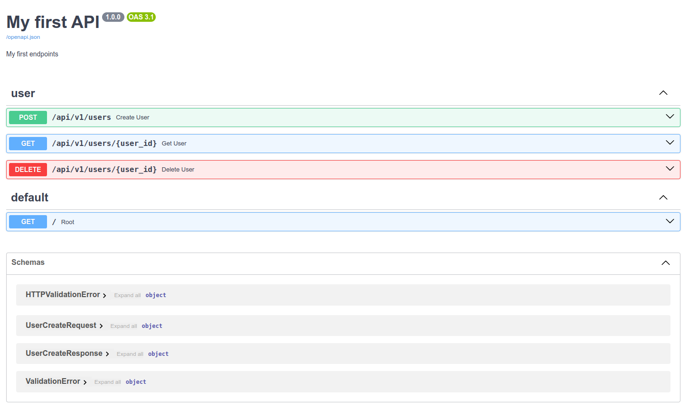

## Instrucciones:
- Instalar las dependencias descritas en `pyproject.toml` usando el comando `poetry install`
- Para levantar el server ` uvicorn fast_api.main:app --reload`

## Este proyecto contiene:
- Ejemplos basicos de python y una api rest con fastapi. 

- La documentacion se puede visualizar en 
  - Swagger: http://127.0.0.1:8000/docs#/    
    
  - Redoc: http://127.0.0.1:8000/redoc

- Tambien contiende en el directorio `fast_api/documentation` un ejemplo para usar un archivo de properties para las descripciones de swagger 
